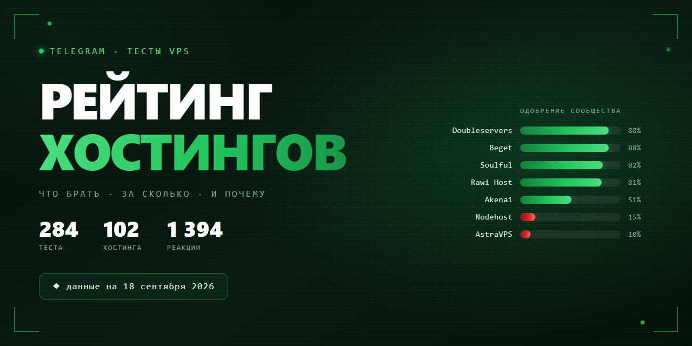

<div align="center">



**Какой VPS взять под ноду, мост или бота — по мнению тех, кто их реально тестировал.**

284 теста · 102 хостинга · чат Telegram «Тесты VPS» · данные на 2026-09-18

  

</div>

---

## ⚡ Если не хочется читать

Четыре варианта, которые закрывают большинство запросов. Процент — доля положительных реакций, рядом указано, на скольких голосах она посчитана.

| | Берите | Цена | Почему именно его |
|:---:|---|---|---|
| 🏆 | **[Doubleservers](https://doubleservers.com)**<br>🇫🇷🇩🇪🇵🇱 | ≈ 11 € | **88%** одобрения при 48 голосах — самая надёжная оценка во всём рейтинге. 9 тестов за четыре месяца, ни одного провального. Берут под ноды, панели и ботов. Из РФ нужен мост |
| 🇷🇺 | **[Beget](https://beget.com)**<br>🇷🇺🇱🇻 | ≈ 660 ₽ | **88%** при 24 голосах. Лучший выбор **под мост из РФ**: рублёвые карты, посуточная оплата, стабильно хвалят третий месяц подряд |
| 🌐 | **[Rawi Host](https://rawi.host)**<br>🇳🇱🇵🇱 | ≈ $6.5 | **81%** при 27 голосах. **Работает без моста из РФ** — то, ради чего в этот чат и приходят. Чистые IP, свежий бренд с ровной серией тестов |
| 💸 | **[Soulful Hosting](https://soulful.host)**<br>🇩🇪🇵🇱 | ≈ 5 € | **82%** при 38 голосах — лучшее соотношение цены и одобрения. 🏷 Часть постов пишет представитель хостинга, они из оценки исключены |

> **Подешевле или поэкзотичнее?** [Alwyzon](https://alwyzon.com) 🇦🇹 — 100% при 15 голосах, 4.49 €. [SharpTech](https://shrp.no) 🇳🇴 — 96% при 25 голосах, $4.8. [Selectel](https://selectel.ru) 🇷🇺 — 100% при 9 голосах, 250 ₽ под мост. **Metrabyte** 🇹🇭 — 100% при 10 голосах, 730 ₽.
>
> У них проценты выше, чем у четвёрки сверху, но и высказалось заметно меньше людей — на одном-двух тестах. Поэтому в основной выбор они не попали, а не потому что хуже.

---

## ⛔ Чего точно не брать

Не «слабые места», а устойчивый негатив на большой выборке.

| Хостинг | Одобрение | Что с ним не так |
|---|:---:|---|
| **AstraVPS** | 10% · 117 голосов | Принудительно закрывают оплаченные тарифы и предлагают переход по ценам ×3–4. Худший результат рейтинга при самой большой выборке |
| **Nodehost** | 15% · 109 голосов | Узлы не встают сутками. Серверы за 3 ₽/сутки скупают абузеры — страдают соседи по ноде |
| **ExpressHost** | 17% · 104 голоса | Стоп ВМ за нагрузку CPU с требованием объяснительной, блокировка РФ-IP, стил на всех локациях. Автор, который раньше его рекомендовал, публично отозвал рекомендацию |
| **Qwins** | 6% · 48 голосов | Фейк-геолокации, баны РФ-IP в первые сутки, связи с bulletproof-хостингом |
| **Hostes.io** | 4% · 49 голосов | Из заявленных 10 Гбит выдаёт 1.5. Часть «тестов» публикует сам представитель хостинга |
| **AdminVPS** | 0% · 32 голоса | Перекуп чужих мощностей. Ни одной положительной реакции за период |

---

## 🎯 Что взять под конкретную задачу

Чат отвечает на «посоветуйте хостинг» одинаково — цитата админа: *«Формируй свои критерии и смотри в тестах — иначе насоветуют то, что под твою задачу не подойдёт»*. Ниже — сводка советов из тредов «Обсуждения».

| Задача | Кого советуют | Сверка с тестами |
|---|---|---|
| **Нода VPN без моста** | [Waicore](https://waicore.com) · [Puws.Cloud](https://puws.cloud) · [Rawi Host](https://rawi.host) | Rawi Host — 81% одобрения, 4 теста; Puws — 60%, отклик смешанный |
| **Нода VPN с мостом из РФ** | [Doubleservers](https://doubleservers.com) · [Hetzner](https://hetzner.com) · [OVH](https://ovhcloud.com) | Doubleservers — 88% при 48 голосах, самый надёжный сигнал в рейтинге |
| **Мост из РФ** | [Beget](https://beget.com) — чаще всех · [Selectel](https://selectel.ru) · [TimeWeb](https://timeweb.cloud) | Beget 88%, Selectel 100% — оба подтверждены свежими тестами |
| **Панель + бот** | [Hetzner](https://hetzner.com) · [OVH](https://ovhcloud.com) · [Doubleservers](https://doubleservers.com) | — |
| **Максимальная стабильность** | [Hetzner](https://hetzner.com) · [OVH](https://ovhcloud.com) | Hetzner 91%, но голосов мало |
| **Экзотические локации** | Норвегия — [SharpTech](https://shrp.no); Таиланд — Metrabyte; Япония — [Akenai](https://akenai.host) · [Zeabur](https://zeabur.com); Латвия — [Veesp](https://veesp.com) | SharpTech и Metrabyte — по одному тесту, но без единого минуса |

Критерии сообщества, по убыванию важности: работа **без моста из РФ** → локация → чистота IP и гео-баз (ТСПУ, блоки РКН, реклама на YouTube) → честность канала и fair use → цена (типичный бюджет 150–500 ₽/мес) → способ оплаты (РФ-карты / СБП / крипта) → скорость поддержки.

> Раздел редакторский: он собран из тредов «Обсуждения» вручную и обновляется реже таблиц. Таблицы ниже считаются скриптом при каждом обновлении дампа.

---

## 🚨 Прочитайте до покупки

Здесь не про скорость — про риск потерять деньги, данные или сервер.

| | Бренд | Почему |
|:---:|---|---|
| ⚠️ | **[Yeezyhost](https://yeezyhost.net)** | Инфраструктура связана с **RedLine Stealer** (малварь) по данным security-исследователей |
| ⚠️ | **[Aeza](https://aeza.net)** | Обыски в офисе «Аеза Групп» и **задержание соучредителя и гендиректора** (июнь 2026). Домен `aeza.gg` — репутация «спамхауса», грязные IP. В рейтинге 27% одобрения при 59 голосах |
| ⚠️ | **[Qwins](https://qwins.co)** | Связи с bulletproof-хостингом; фейк-геолокации (Швеция = Финляндия, Финляндия определяется как USA); серверы банятся в РФ в первые сутки. 6% одобрения — один из худших результатов рейтинга |
| ⚠️ | **[AstraVPS](https://astravps.ru)** | Принудительно закрывают оплаченные тарифы и предлагают переход по ценам ×3–4 (август 2026). 16 тестов, 10% одобрения — худший показатель среди брендов с большой выборкой |
| ⚠️ | **[Nodehost](https://nodehost.ru)** | Узлы не встают сутками; серверы за 3 ₽/сутки скупают абузеры — страдают соседи по ноде. 15% одобрения при 109 голосах |
| ⚠️ | **[ExpressHost](https://t.me/ExpressHost_Bot)** | Стоп ВМ за нагрузку CPU с требованием объяснительной, блокировка РФ-IP, стил на всех локациях. Автор, который раньше его рекомендовал, публично отозвал рекомендацию (август 2026) |
| ⚠️ | **[Hostes.io](https://hostes.io)** | Часть «тестов» публикует представитель хостинга. Такие посты исключены из Score — см. колонку «вендор» |
| ⚠️ | **[Play2Go](https://play2go.cloud)** | Пакетлоссы 10–20%, тикеты висят неделями с авто-закрытием. DE/PL приемлемы, FI/SE нестабильны |

### Отдельно про рефссылки

**48% тестов в датасете содержат реферальную ссылку.** Это не делает тест недостоверным — в чате так принято, и ссылки обычно даются парой «реф / не реф». Но на позицию в рейтинге это не влияет никак: Score считается только из реакций аудитории, а сам факт рефссылки вынесен в отдельную колонку, чтобы вы видели его сами.

Посты, которые пишет представитель хостинга, из Score исключены полностью — их видно в колонке «вендор».

---

## 📊 Полный рейтинг

**Одобрение** — доля положительных реакций. **Порядок** учитывает ещё и то, на скольких голосах она посчитана: 100% от девяти человек — слабее, чем 88% от сорока восьми, поэтому такой хостинг стоит ниже. **Цена** — медиана из текстов тестов, ориентир, а не прайс.

<sub>●●● 25+ голосов · ●●○ 10–24 · ●○○ 1–9 &nbsp;|&nbsp; 🏷 есть посты от представителя хостинга &nbsp;|&nbsp; 🎭 есть сатира &nbsp;|&nbsp; 📈 📉 последние 90 дней заметно отличаются</sub>

### 🟢 Хорошо

*Одобрение уверенно держится выше половины даже по нижней границе.*

| # | Хостинг | Одобрение | Цена | Голосов | Тестов | Тренд | Страны |
|:---:|---|---|:---:|:---:|:---:|:---:|:---:|
| 1 | **[SharpTech](https://shrp.no)** | `██████████` **96%** | $4.8 | 25 ●●● | 1 | — | 🇳🇴 |
| 2 | **[Alwyzon](https://alwyzon.com)** | `██████████` **100%** | €4.49 | 15 ●●○ | 2 | — | 🇦🇹 |
| 3 | **[Doubleservers](https://doubleservers.com)** | `█████████░` **88%** | €11 | 48 ●●● | 9 | = | 🇫🇷🇩🇪🇵🇱 |
| 4 | **Metrabyte** | `██████████` **100%** | 730 ₽ | 10 ●●○ | 1 | = | 🇹🇭 |
| 5 | **[Selectel](https://selectel.ru)** | `██████████` **100%** | 250 ₽ | 9 ●○○ | 4 | — | 🇷🇺🇰🇿 |
| 6 | **[Beget](https://beget.com)** | `█████████░` **88%** | 660 ₽ | 24 ●●○ | 9 | 📉 | 🇷🇺🇱🇻 |
| 7 | **[Soulful Hosting](https://soulful.host)** 🏷 | `████████░░` **82%** | €5 | 38 ●●● | 7 | = | 🇩🇪🇵🇱 |
| 8 | **[Hostdzire](https://hostdzire.com)** | `██████████` **100%** | €10 | 7 ●○○ | 1 | = | — |
| 9 | **[Rawi Host](https://rawi.host)** | `████████░░` **81%** | $6.5 | 27 ●●● | 4 | = | 🇳🇱🇵🇱 |

### 🔵 Рабочие

*Больше плюсов, чем минусов, но запас невелик.*

| # | Хостинг | Одобрение | Цена | Голосов | Тестов | Тренд | Страны |
|:---:|---|---|:---:|:---:|:---:|:---:|:---:|
| 10 | **[Tihost](https://t.me/Tihost)** | `███████░░░` **72%** | — | 18 ●●○ | 5 | 📉 | 🇫🇮🇩🇪🇵🇱 |
| 11 | **H2Nexus** | `████████░░` **75%** | — | 12 ●●○ | 1 | = | 🇫🇮 |
| 12 | **[Puws.Cloud](https://puws.cloud)** | `██████░░░░` **60%** | €5 | 25 ●●● | 3 | = | 🇵🇱 |
| 13 | **[Akenai](https://akenai.host)** | `█████░░░░░` **51%** | $12.99 | 51 ●●● | 12 | 📈 | 🇩🇪🇳🇱🇯🇵🇬🇧🇮🇹 |
| 14 | **[Freakhosting](https://freakhosting.com)** | `██████░░░░` **60%** | 214 ₽ | 10 ●●○ | 3 | — | 🇩🇪🇺🇸 |
| 15 | **[Hostup](https://hostup.co)** | `██████░░░░` **62%** | €2.94 | 8 ●○○ | 2 | = | 🇸🇪 |
| 16 | **[Turtleguard](https://turtleguard.cloud)** | `███████░░░` **67%** | $11 | 6 ●○○ | 2 | = | 🇩🇪🇳🇱 |

### 🟡 Спорные

*Мнения расходятся или выборка не даёт уверенности.*

| # | Хостинг | Одобрение | Цена | Голосов | Тестов | Тренд | Страны |
|:---:|---|---|:---:|:---:|:---:|:---:|:---:|
| 17 | **[Datagio](https://datagio.net)** 🏷 | `████░░░░░░` **38%** | 400 ₽ | 52 ●●● | 14 | = | 🇩🇪🇳🇱🇵🇱 |
| 18 | **StenCloud** 🏷 | `█████░░░░░` **46%** | €3.5 | 13 ●●○ | 5 | = | 🇪🇪🇳🇱 |
| 19 | **[Cloudrix](https://cloudrix.ru)** | `██████░░░░` **60%** | — | 5 ●○○ | 1 | — | 🇷🇺 |
| 20 | **[Xytor](https://xytor.cloud)** | `████░░░░░░` **36%** | 474 ₽ | 39 ●●● | 6 | = | 🇵🇱 |
| 21 | **[Hip-Hosting](https://hshp.host)** | `█████░░░░░` **50%** | $2.4 | 8 ●○○ | 4 | = | 🇩🇪🇪🇪 |
| 22 | **[Vyrex](https://vyrex.co)** 🏷 | `████░░░░░░` **35%** | 598 ₽ | 31 ●●● | 7 | 📉 | 🇳🇱🇩🇪 |
| 23 | **[Aeza](https://aeza.net)** | `███░░░░░░░` **27%** | €5.93 | 59 ●●● | 9 | = | 🇫🇮🇩🇪🇷🇺 |
| 24 | **[Dedicate IT](https://t.me/dedicate_it_bot)** | `████░░░░░░` **43%** | 599 ₽ | 7 ●○○ | 1 | = | 🇩🇪 |

### 🔴 Избегать

*Негатив преобладает устойчиво.*

| # | Хостинг | Одобрение | Цена | Голосов | Тестов | Тренд | Страны |
|:---:|---|---|:---:|:---:|:---:|:---:|:---:|
| 25 | **[Clouvider](https://clouvider.com)** | `████░░░░░░` **38%** | €4.05 | 8 ●○○ | 1 | — | 🇳🇱 |
| 26 | **[Forestsnet](https://forestsnet.cloud)** | `████░░░░░░` **38%** | €4.8 | 8 ●○○ | 3 | = | 🇳🇱 |
| 27 | **[ExpressHost](https://t.me/ExpressHost_Bot)** | `██░░░░░░░░` **17%** | $3.22 | 104 ●●● | 11 | = | 🇳🇱🇪🇪🇵🇱 |
| 28 | **PowerRDP** 🎭 | `███░░░░░░░` **27%** | $6 | 15 ●●○ | 3 | = | 🇵🇱 |
| 29 | **[Nodehost](https://nodehost.ru)** | `█░░░░░░░░░` **15%** | 202 ₽ | 109 ●●● | 11 | = | 🇫🇮🇸🇪🇵🇱🇳🇱🇩🇪 |
| 30 | **[OneDash](https://t.me/OneDash)** | `██░░░░░░░░` **15%** | 214 ₽ | 66 ●●● | 10 | = | 🇩🇪🇳🇱🇺🇸🇷🇺🇫🇮 |
| 31 | **[AstraVPS](https://astravps.ru)** 🎭 | `█░░░░░░░░░` **10%** | 368 ₽ | 117 ●●● | 16 | = | 🇪🇪🇫🇮🇳🇱🇩🇪 |
| 32 | **[Play2Go](https://play2go.cloud)** 🎭 | `█░░░░░░░░░` **12%** | 780 ₽ | 40 ●●● | 5 | — | 🇩🇪🇵🇱🇸🇪🇫🇮 |
| 33 | **LunarHost** | `█░░░░░░░░░` **14%** | 575 ₽ | 21 ●●○ | 2 | = | 🇳🇱🇩🇪 |
| 34 | **[Intezio](https://intezio.net)** | `██░░░░░░░░` **15%** | 310 ₽ | 13 ●●○ | 2 | = | 🇵🇱 |
| 35 | **[Lili.cloud](https://lili.cloud)** | `██░░░░░░░░` **20%** | €12.5 | 5 ●○○ | 1 | = | 🇳🇱 |
| 36 | **[Qwins](https://qwins.co)** | `█░░░░░░░░░` **6%** | $5 | 48 ●●● | 5 | = | 🇵🇱🇳🇱 |
| 37 | **[It-Garage](https://it-garage.pro)** | `█░░░░░░░░░` **9%** | €6.75 | 11 ●●○ | 1 | — | 🇩🇪 |
| 38 | **[ToolVPS](https://toolvps.com)** | `█░░░░░░░░░` **8%** | — | 12 ●●○ | 2 | = | 🇳🇱 |
| 39 | **[Hostes.io](https://hostes.io)** 🏷 | `░░░░░░░░░░` **4%** | $10 | 49 ●●● | 6 | = | 🇳🇱🇵🇱🇩🇪 |
| 40 | **Eternity Cloud** 🏷 | `█░░░░░░░░░` **6%** | €7 | 16 ●●○ | 3 | = | 🇪🇪🇩🇪 |
| 41 | **[AdminVPS](https://adminvps.ru)** | `░░░░░░░░░░` **0%** | 799 ₽ | 32 ●●● | 2 | = | 🇷🇺🇵🇱 |
| 42 | **[VpsPay](https://t.me/VPSPay_bot)** | `░░░░░░░░░░` **0%** | $3.9 | 22 ●●○ | 2 | — | 🇫🇮 |
| 43 | **[4VPS](https://4vps.su)** | `░░░░░░░░░░` **0%** | 590 ₽ | 12 ●●○ | 3 | — | 🇭🇰🇺🇸🇦🇹 |
| 44 | **[DataCheap](https://datacheap.ru)** | `░░░░░░░░░░` **0%** | 639 ₽ | 11 ●●○ | 1 | = | 🇳🇱 |
| 45 | **[H1Cloud](https://h1cloud.net)** | `░░░░░░░░░░` **0%** | 150 ₽ | 11 ●●○ | 1 | = | 🇨🇭 |
| 46 | **Dataforest** | `░░░░░░░░░░` **0%** | — | 9 ●○○ | 1 | = | — |
| 47 | **[MTW](https://mtw.ru)** | `░░░░░░░░░░` **0%** | 385 ₽ | 7 ●○○ | 1 | — | 🇷🇺 |
| 48 | **[UFO Hosting](https://ufo.hosting)** | `░░░░░░░░░░` **0%** | — | 7 ●○○ | 1 | = | — |
| 49 | **[Serverspace](https://serverspace.ru)** | `░░░░░░░░░░` **0%** | — | 6 ●○○ | 2 | — | 🇳🇱🇰🇿 |
| 50 | **SmartApe** | `░░░░░░░░░░` **0%** | 510 ₽ | 6 ●○○ | 1 | = | — |
| 51 | **DieselHost** | `░░░░░░░░░░` **0%** | 277 ₽ | 5 ●○○ | 1 | = | 🇵🇱 |

### ⚪ Мало данных

51 брендов набрали меньше 5 голосов. Это не оценка — по ним просто нечего считать, и ставить их рядом с остальными было бы враньём.

<details><summary>Показать список</summary>

| Хостинг | Тестов | Голосов | Страны |
|---|:---:|:---:|:---:|
| **[Veesp](https://veesp.com)** | 5 | 0 | 🇸🇪🇱🇻🇳🇱 |
| **[Waicore](https://waicore.com)** | 5 | 3 | 🇩🇪🇫🇮 |
| **Nivaro** 🏷 | 4 | 1 | 🇩🇪🇪🇪🇳🇱 |
| **[Netgrid](https://netgrid.host)** | 3 | 4 | 🇧🇬🇵🇱 |
| **[Bluevps](https://bluevps.com)** | 2 | 3 | 🇪🇪 |
| **DeluxHost** | 2 | 4 | 🇳🇱 |
| **[HostKey](https://hostkey.com)** | 2 | 0 | — |
| **[IShosting](https://ishosting.com)** | 2 | 0 | 🇰🇿🇸🇪 |
| **[On1x](https://on1x.cloud)** 🏷 | 2 | 0 | 🇩🇪 |
| **[Serv.host](https://serv.host)** | 2 | 1 | 🇪🇪 |
| **[Upcloud](https://upcloud.com)** | 2 | 3 | 🇩🇪 |
| **Wuldi** | 2 | 2 | 🇳🇱🇨🇿 |
| **[Yottasrc](https://yottasrc.com)** | 2 | 2 | 🇳🇱🇸🇪 |
| **[1cent.host](https://1cent.host)** | 1 | 0 | 🇩🇪🇫🇮🇪🇪 |
| **AVAServer** | 1 | 0 | 🇰🇿 |
| **[AlexHost](https://alexhost.com)** | 1 | 0 | 🇧🇬🇸🇪 |
| **[Awas](https://awas.ovh)** | 1 | 1 | — |
| **[Blackmore](https://blackmore.cloud)** | 1 | 0 | 🇳🇱 |
| **Cherry Servers** | 1 | 2 | 🇸🇪 |
| **[DHostvps](https://t.me/dhostVPS_bot)** | 1 | 1 | 🇩🇪🇳🇱 |
| **[Dasabo](https://dasabo.com)** | 1 | 1 | 🇩🇪 |
| **EvonixCloud** | 1 | 0 | 🇳🇱 |
| **[FirstVDS](https://firstvds.ru)** | 1 | 4 | 🇷🇺 |
| **[G-Core](https://gcore.com)** | 1 | 1 | 🇰🇿 |
| **[HOSTOFF.NET](https://hostoff.net)** | 1 | 2 | 🇵🇱 |
| **[Hetzner](https://hetzner.com)** | 1 | 4 | 🇩🇪 |
| **[ITLDC](https://itldc.com)** | 1 | 0 | 🇱🇻 |
| **[Inferno](https://inferno.name)** | 1 | 1 | 🇳🇱 |
| **[Infomaniak](https://infomaniak.com)** | 1 | 1 | 🇨🇭 |
| **Infrawire** | 1 | 2 | 🇫🇷 |
| **Kyonix** | 1 | 0 | 🇩🇪 |
| **[Makecloud](https://makecloud.ru)** | 1 | 2 | 🇷🇺 |
| **[MarshallHost](https://marshallhost.com)** | 1 | 3 | — |
| **[Melbicom](https://melbicom.net)** | 1 | 3 | 🇳🇬 |
| **Midas Hosting** | 1 | 1 | 🇩🇪 |
| **[Netangels](https://netangels.ru)** | 1 | 0 | 🇷🇺 |
| **Phylex** 🏷 | 1 | 0 | 🇳🇱 |
| **[Profitserver](https://profitserver.ru)** | 1 | 1 | 🇨🇭 |
| **[Purecloud](https://t.me/purecloud_robot)** | 1 | 1 | 🇵🇱 |
| **[RU-Center](https://nic.ru)** | 1 | 3 | — |
| **[Rabisu](https://rabisu.com)** | 1 | 3 | 🇹🇷 |
| **[Realtoxmedia](https://realtoxmedia.de)** | 1 | 1 | 🇩🇪 |
| **[Rifty](https://rifty.org)** | 1 | 2 | 🇩🇪 |
| **SWE Hosting** | 1 | 3 | 🇸🇪 |
| **[ServCity](https://servcity.org)** | 1 | 4 | — |
| **[TNAHosting](https://tnahosting.net)** | 1 | 3 | 🇺🇸 |
| **[TimeWeb](https://timeweb.cloud)** | 1 | 3 | 🇷🇺 |
| **VDSKA** | 1 | 0 | 🇰🇿 |
| **[Vultr](https://vultr.com)** | 1 | 0 | 🇸🇬 |
| **[Zeabur](https://zeabur.com)** | 1 | 0 | 🇯🇵 |
| **[iwihost](https://iwihost.net)** | 1 | 0 | 🇺🇸 |

</details>

---

## Как это считается

Источник — сообщения чата «Тесты VPS» за 2026-05-13 — 2026-09-18. Тестом считается пост со скриншотом, узнанным хостингом и вердиктом автора: таких **284** по **102 брендам**, из них 51 набрали достаточно реакций для оценки.

### Оценка

Считается **нижняя граница 95% доверительного интервала Уилсона** для доли положительных реакций — «сколько одобрения у бренда в худшем правдоподобном случае»:

```
         p̂ + z²/2n − z·√( (p̂(1−p̂) + z²/4n) / n )
оценка = ─────────────────────────────────────────
                      1 + z²/n
```

где `p̂` — доля плюсов, `n` — всего голосов, `z = 1.96`.

Простая сумма «плюсы минус минусы» поощряла бы количество тестов, а не качество: бренд с тридцатью тестами набирает больше просто потому, что его чаще берут. Уилсон отвечает на правильный вопрос и сам занижает оценку там, где голосов мало.

### Что считается, а что нет

- **470** положительных реакций против **923** отрицательных.
- **260** реакций (😁 🤣 🤔 и подобные) знака не несут: одинаково часто означают «смешно, потому что хорошо» и «смешно, потому что позор». Они считаются отдельно, а не приписываются к плюсам молча.
- **205** кастом-эмодзи Telegram отдаёт без идентификатора — опознать их нечем. Исключены и показаны здесь, а не растворены в цифрах.
- **3** сатирических обзоров и **15** постов от представителей хостинга в оценку не идут — они помечены 🎭 и 🏷.
- **135 из 284** тестов содержат рефссылку. На позицию это не влияет: оценка считается только из реакций аудитории.

### Реакции на разгромный обзор

Под текстом «самый отвратительный хостинг, кромешный ад за 30 дней» ❤ и 🔥 означают **согласие с критикой**, а не похвалу. Поэтому отклик под разгромным обзором засчитывается в минус. Реальный случай: такой обзор AdminVPS собрал 🔥×22 — при прямолинейном подсчёте это дало бы бренду **+26**.

Обратное правило тоже работает: на **положительном** обзоре знак не переворачивается. Тест 4VPS «взял на тест, пока норм, отвалов не было» собрал 💩×8 — это недоверие аудитории к выводу автора, и оно честно идёт в минус.

### Чего эта методика не умеет

- **История до 2026-05-13 недоступна.** Прежние версии рейтинга считались вручную по другой методике из данных, которых больше нет. Сравнивать старый Score и текущую оценку напрямую нельзя.
- **Один тест — один бренд.** Сравнительные посты приписываются первому упомянутому.
- **Реакция — это не проверка.** Здесь измеряется мнение чата, а не независимое тестирование: люди реагируют и на текст, и на автора, и на мем.
- **55 тестов не собрали ни одной реакции.** Молчание аудитории — не нейтральная оценка, а отсутствие данных.

Разбор по чату «Обсуждение хостингов» — в [DISCUSSION_RATING.md](./DISCUSSION_RATING.md).

---

*Данные на 2026-09-18 · Тестов: 284 · Брендов: 102*
